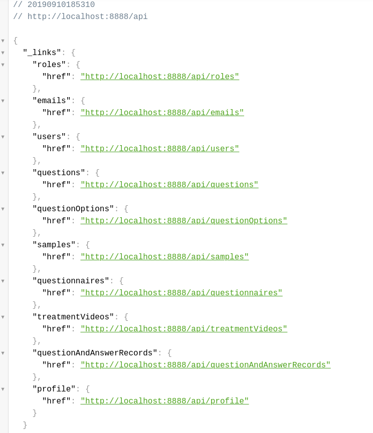
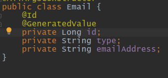

# The Mind Initiate Project #
## API documentations
### mysql-db
  * To start the mysql-db, there are two ways:
    1. If it is currently in idea, just go to MysqlDbApplication.java which is under mysql-db/src/main/java/mysql/db, click the __Run__ Button
    2. If it is in the terminal, go to the mind-initiate directory and type in ./gradlew :mysql-db:bootRun (linux or mac), gradlew.bat :mysql-db:bootRun (Windows)
  * To get the information of api links, go to http://localhost:8888/api when you have successfully start the mysql-db, and all the related apis will be describe as below:
  
    * Take the emails table for example, 
    The general api is http://localhost:8888/api/emails
    while the Java class is
    
    we can see that the required attribute is type and emailAddress,
    since id will be auto generated.
        * To retrive all the emails, use Http GET Method:
        * To add new email to the database use Http POST Method:
        * To delete the email, use HTTP DELETE, but the usage is
        a little bit different, if we just send the delete method to
        that api url, all the emails will be delete, so be careful,
        if we append/{id} to that url, it will just delete that specific item
        * feel free to check the example [api usage example](example_api.http)
         
    
  
  

